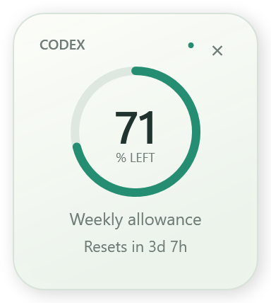
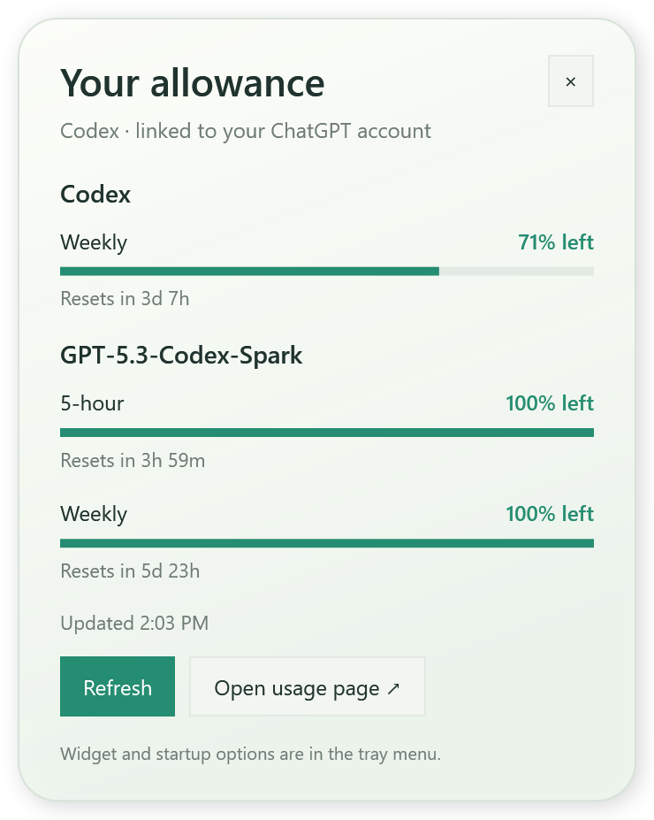

# Codex Quota

A small Windows tray app that shows your real Codex allowance. Click the tray icon for all reported quota windows and reset times, or keep a floating ring beside your work.





## What it does

- Shows remaining Codex percentage in a dynamic tray icon and a movable floating widget.
- Automatically shows the widget while the Codex or ChatGPT desktop app is running, including when minimized. Closing all desktop app windows hides it. The tray icon stays available.
- Offers always-visible and tray-only modes. Drag the **CODEX** header to move the widget. Click the ring for details. The × dismisses it until the next detected desktop app session.
- Displays every reported usage bucket separately, including Spark when available. The ring uses the lowest remaining percentage among Codex's reported windows.
- Refreshes every 60 seconds while an app/widget is active, every 3 minutes otherwise, and on demand. Failures retain clearly labeled last-known values; missing data is never treated as 100%. A passed reset time stays unavailable until fresh data arrives.
- Starts at Windows sign-in, with an option in the tray menu to turn that off.

This tracks **Codex allowance associated with your ChatGPT account**. It does not claim to track every regular ChatGPT message, image, voice, or research limit. Windows may initially put the tray icon in its overflow menu; drag it beside the clock or enable it in Taskbar settings.

## Install

Download and extract the Windows x64 ZIP from [Releases](https://github.com/bunthius/codex-quota/releases), then run this in PowerShell from the extracted folder:

```powershell
powershell -NoProfile -ExecutionPolicy Bypass -File .\Install.ps1
```

The installer puts the app in `%LOCALAPPDATA%\Programs\CodexQuota`, adds a Start menu shortcut and an Installed Apps entry, enables startup for the current Windows user, and launches it. Administrator privileges are not needed. The release includes .NET; no separate runtime is required.

Codex must already be installed and signed in with your ChatGPT account. The app discovers the Codex executable from the desktop installation or PATH; **Locate Codex…** in the tray menu supports a custom `codex.exe` location. It uses Codex's normal sign-in. It does not ask for an API key or copy your credentials.

## Build and verify

Requires Windows x64 and the .NET 8 SDK. No third-party NuGet dependencies.

```powershell
.\scripts\Build.ps1
.\scripts\Install.ps1
```

Diagnostic commands (output paths must be writable):

```powershell
dotnet run --project tests/CodexQuota.Tests -c Release
.\artifacts\publish\CodexQuota.exe --probe C:\temp\quota.json
.\artifacts\publish\CodexQuota.exe --smoke C:\temp\quota-smoke
.\artifacts\publish\CodexQuota.exe --render C:\temp\quota-fixtures
```

`--probe` reads live quota once and exits. `--smoke` exercises the live reader and both native windows, writes PNGs and a JSON report, and exits. `--render` renders synthetic healthy, low, empty, full, stale, and unavailable states without querying the account. Diagnostics do not modify startup registration. `--quit` cleanly exits an already-running normal instance.

## Connection and privacy

The app launches a short-lived hidden `codex app-server --stdio`, performs the documented initialization handshake, and calls `account/rateLimits/read`. It closes its own connection after each read. It does not create threads, run model turns, scan chat history, scrape browser sessions, expose a network listener, or send data to any other service.

Codex itself handles authentication and requests to OpenAI. The app discards server diagnostic output and retains no tokens, emails, or account IDs. Preferences and a small local health report containing quota freshness and display status live in `%LOCALAPPDATA%\CodexQuota`. Neither belongs in Git. There is no telemetry.

The app-server interface can change between Codex versions; connection failures are visible and retried. [Official protocol documentation](https://learn.chatgpt.com/docs/app-server).

## Uninstall

Use **Windows Settings → Apps → Installed apps → Codex Quota → Uninstall**, or run:

```powershell
powershell -NoProfile -ExecutionPolicy Bypass -File "$env:LOCALAPPDATA\Programs\CodexQuota\Uninstall.ps1"
```

Uninstall removes the executable, startup entry, and shortcut. Add `-RemovePreferences` to also remove local preferences and health data. Your Codex installation and account are not changed.
